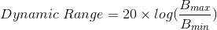

## Table of Content
1. [Problem statement and motivation](#Problem-statement-and-motivation)
2. [High-level summary of the procedure](#High-level-summary-of-the-procedure)
3. [HDR radiance image reconstruction (Debevec's algorithm)](#HDR-radiance-image-reconstruction-(Debevec's-algorithm))
4. [Tone Mapping algorithms](#Tone-Mapping-algorithms)
   1. [Reinhard's algorithm](#Reinhard's-algorithm)
   2. [Durand's algorithm](#Durand's-algorithm)
5. [Results](#Results)
6. [Conclusion and future work](#Conclusion-and-future-work)
7. [Reference](#Reference)


### Problem statement and motivation
The range of intensity of light in real world is approximately **10** orders of magnitudes (e.g., star-lit scene vs. sun-lit snow) and it can be over **4** orders of magnitudes in one scene (e.g., shadows vs. highlights). However, the range of intensity of light that can be captured by normal cameras and can be displayed by normal monitors is only about **2** orders of magnitudes. The ability of capturing and displaying both very dark and very bright at the same time is characterized by the **dynamic range** of the device. The dynamic range is defined by the following equation:





### High-level summary of the procedure
### HDR radiance image reconstruction (Debevec's algorithm)
### Tone Mapping algorithms
#### Reinhard's algorithm
#### Durand's algorithm
### Results
### Conclusion and future work
### Reference


You can use the [editor on GitHub](https://github.com/zhangboyu/zhangboyu.github.io/edit/master/README.md) to maintain and preview the content for your website in Markdown files.

Whenever you commit to this repository, GitHub Pages will run [Jekyll](https://jekyllrb.com/) to rebuild the pages in your site, from the content in your Markdown files.

### Markdown

Markdown is a lightweight and easy-to-use syntax for styling your writing. It includes conventions for

```markdown
Syntax highlighted code block

# Header 1
## Header 2
### Header 3

- Bulleted
- List

1. Numbered
2. List

**Bold** and _Italic_ and `Code` text

[Link](url) and 
```

For more details see [GitHub Flavored Markdown](https://guides.github.com/features/mastering-markdown/).

### Jekyll Themes

Your Pages site will use the layout and styles from the Jekyll theme you have selected in your [repository settings](https://github.com/zhangboyu/zhangboyu.github.io/settings). The name of this theme is saved in the Jekyll `_config.yml` configuration file.

### Support or Contact

Having trouble with Pages? Check out our [documentation](https://help.github.com/categories/github-pages-basics/) or [contact support](https://github.com/contact) and we’ll help you sort it out.
