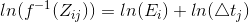
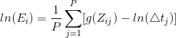
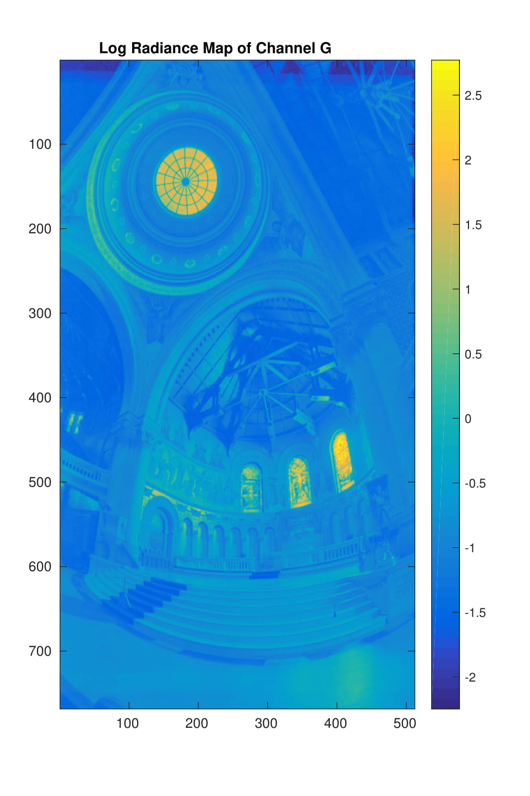

## Table of Content
1. [Problem statement and motivation](#problem-statement-and-motivation)
2. [High-level summary of the procedure](#high-level-summary-of-the-procedure)
3. [HDR radiance image reconstruction (Debevec's algorithm)](#hdr-radiance-image-reconstruction-debevecs-algorithm)
4. [Tone mapping algorithms](#tone-mapping-algorithms)
   1. [Reinhard's algorithm](#reinhards-algorithm2)
   2. [Durand's algorithm](#durands-algorithm3)
5. [Results](#results)
6. [Conclusion and future work](#conclusion-and-future-work)
7. [Reference](#reference)

### Problem statement and motivation
The range of intensity of light in real world is approximately **10** orders of magnitudes (e.g., star-lit scene vs. sun-lit snow) and it can be over **4** orders of magnitudes in one scene (e.g., shadows vs. highlights). However, the range of intensity of light that can be captured by normal cameras and can be displayed by normal monitors is only about **2** orders of magnitudes. The ability of capturing and displaying both very dark and very bright at the same time is characterized by the **dynamic range** of the device. The dynamic range is defined by the following equation:

  

Where  is the maximum possbile photon energy (full potential well) and  is the minimum detectable photon energy (in the presence of noise). The larger the dynamic range is, the higher the ability of distinguishing different brightness. The following table shows the dynamic ranges of several devices.

Device          |  : | Dynamic Range
:--------------:|-------------------------------------------------:|:-------------:
Human Eye       | 1,000,000:1                                      |120
HDR Display     | 200,000:1                                        |106
Digital Camera  | 4096:1                                           |72.2
Film Camera     | 2948:1                                           |66.2
Digital Video   | 45:1                                             |33.1

Due to this huge discrepancy between the dynamic range of real world and the dynamic ranges of capturing and displaying devices, the details in both very dark and very bright regions of the scene are lost. For example, the details of the color of the windows and the structures in the left dark regions are not clear in the following image.

  

When such images are used as input of various image-related algorithms, the results may not be satisfactory due to the lack of details in the image. For example, many image-based modeling and rendering systems make the assumption that all the images are taken with the same exposure settings and film response functions, which is almost impossible for any large-scale environment. Moreover, most image processing operations, such as blurring, edge detection, color correction, and image correspondence, expect pixel values to be proportional to the scene radiance. These operations will produce incorrect results for conventional images due to saturated pixels. Furthermore, generating good-looking images gains increasingly more importance with the prevalence of smart phone. Thus, the goal of this project is to explore how to bring back the details in both dark and bright regions and then generate good-looking images.

### High-level summary of the procedure

At high level, the procedure of generating good-looking images with clear details consists of two stages. 
1. In the first stage, we want to estimate the radiance value of each scene point so that we know the real light intensity of every scene point. 
2. In the second stage, we want to map the radiance image obtained from the first stage to display luminance values so that the details in dark and bright regions can be shown clearly with the display medium. 

### HDR radiance image reconstruction (Debevec's algorithm)

The goal of this stage is to estimate the radiance value at every scene point from a set of images that are taken from the same vatange point with different known exposure duration. Here, I used Debevec's algorithm\[1\] to achieve this purpose. 

Assuming we have a set of images taken from the same vantage point with the same aperture but different exposure duration. The radiance value of each scene point is , where `i` is spatial index. The exposure duration is , where `j` is time index. The pixel value corresponding to spatial index `i` and time index `j` is . As shown in the figure below, for any imaging system, photons pass through the shutter and accumulated at image sensor, then the raw data from the sensor passes through the camera response function to get the final pixel value. The camera response function `f` is a non-linear function that is different for each camera and proprietary to each manufactory. Thus, the pixel value  can be expressed as a non-linear function `f` applied to the product of  and , which is also shown below.

  

  

After taking inverse of `f` and logarithm on both sides, then simplifying the notation, we get:

  

  

  

In order to solve  for every scene point, we need to figure out the function `g` for all possible `Z` values that best satisfies the above equation in a least-square error manner. Since every scene point satisfies above equation and `Z` is an integer from 0 to 255, we can turn the problem of solving funtion `g` to an optimization problem where the objective function is shown as follows:

  

Where `N` is the number of pixels used in the linear equation system and `P` is the number of images available. The first term in the objective function ensures the solution satisfies the aforementioned equations, and the second term ensures the estimated function `g` is smooth. Minimizing the objective function  is a straightforward linear least square problem and can be easily solved in Matlab. After solving function `g`, the radiance values of each scene point can be calculated by taking the average radiance value among the `P` images, which is shown as following:

  

One natural question to ask is that how many pixels are needed to solve the equation system. Notice that in the above system, the unknowns are the value of function `g` on all possible `Z` values and the radiance values `E` of the scene points that corresponds to the picked pixels. Thus, as long as the following equation is met, the solution can be found. For example, when `P=11`, `N>50` is more than enough.

  

However, not all pixels are equally good in terms of solving the linear equation system and randomly sampled pixels may not generate satisfactory result. For example, if the pixel value is either 0 or 255 across all the images, it does not provide any useful information in solving the function `g`. In order to pick "good" pixels, I sliced the images into many tiles, then for each tile, I picked the pixel that has highest standard deviation among images. 

  

This simple heuristic is indeed able to generate very good results. Since the imaging system may have different response function `g` for different color, the three channels of the image are treated separately and the results are shown in the table. The red curves in the response curve figures are function `g` for different color channels, the blue dots correspond to the sampled pixels, and the values in the radiance map figures are in log space.

R Channel                     |G Channel                        |B Channel
:----------------------------:|:-------------------------------:|:------------------------------:
||
||

### Tone Mapping algorithms

The problem of tone mapping considers how to map the high dynamic range radiance values in real world to low dynamic range display luminance values such that the details in both dard and bright regions become clearer. I implemented two algorithms from Reinhard and Durand. 

#### Reinhard's algorithm[2]

This algorithm is inspired by the Zone System that was developed in the 1940s. The main idea is to map the middle brightness of the scene to the middle brightness of the display medium, so that the overall brightness of the entire scene is well captured. The main 3 steps of the algorithm is illustrated below:

1. Calculate the radiance value that corresponds to the average brightness of human perception of the scene. Since the brightness perception of human is logarithmic to scene radiance, we need to calculate the average of the logarithm of the scene radiance first and then map it back to radiance value. Suppose  is the radiance value of scene location `(x,y)` and the total number of pixels in the scene is `N`, then the average radiance is given by:
   
   

2. Scale the radiance values so that the average radiance value calculated from the first step is mapped to `a`, which is the middle brightness (e.g., middle-gray) of the display medium. `a` is usually set to 0.18 but can be adjusted to alter the overall brightness of the image. 
   
   

3. After the second step, the very bright pixels may still been mapped to values that are larger than 1, which exceeds the luminance limits of the display medium (`0~1`). Since modern photography favors to compress mainly the high luminances, we need to apply a non-linear transformation to compress high luminances to values that are smaller than 1 and leave the low luminances almost intact. Such a non-linear transformation is shown below, where the  is set to the maximum luminance in the scene by default. 
   
   

The results of this algorithm is shown below. Although not obvious, more details are indeed show up in the new image if we zoom in.

Original Image                             |Tone Mapped Image
:-----------------------------------------:|:-----------------------------:
 | 

#### Durand's algorithm[3]

The main idea of this algorithm is to decompose the radiance image into two layers: a base layer, which encoding large-scale variations, and a detail layer. Only the base layer's contrast is reduced, thereby details are preserved in the tone mapped iamge. This algorithm can also be illustrated in 3 steps:

1. The base layer is obtained by applying an edge-preserving filter, namely, bilateral filter on the logarithm of the radiance image. The reason of using the logarithm of the radiance image is explained in the first step of the Reinhard's algorithm. Bilateral filter is a non-linear filter, where the weight of each pixel is computed using a Gaussian in the spatial domain multiplied by an influence function in the intensity domain that decreases the weight of pixels with large intensity differences[3]. The result of applying this filter is that the image is blurred but the edges are preserved. Mathematically, this step can be expressed as:
   
   

2. The detail layer is extracted by subtracting the base layer from the logarithm of the radiance image. 
   
   

3. Base layer get shifted and contrast reduced first. Then the detail layer is added back to it. Finally, we take its exponential to be the fianl luminance value. The purpose of shift is to make sure that the component from the base layer after exponential is less than upper limit of the luminance value, which is 1.
   
   

The results of various step of this algorithm are shown below. The effects of this algorithm is very obvious. However, the color of the tone mapped image seems little unnatural. 

Original Image      |Base Layer            |Detail Layer           |Tone Mapped Image
:------------------:|:--------------------:|:---------------------:|:-------:
 |  |  | 

### Results

This section contains the results of both tone mapping algorithms on many images. The images are taken either by myself or from [Guan's website](https://github.com/drakeguan/vfx11spring_project1/tree/master/image/original). The regions with the most obvious improvement in terms of visible details are highlighted in the original images with red circles. In general, Durand's algorithm is able to reveal more details than Reinhard's algorithm, but it also suffers from the fact that the resulted images are not as natural as those from Reinhard'a algorithm.

Original Image      |Reinhard's Algorithm       |Durand's Algorithm
:------------------:|:-------------------------:|:---------------------:
 |  | 
 |  | 
 |  | 
 |  | 
 |  | 
 |  | 
 |  | 
 |  | 

### Conclusion and future work

1. Based on the results, it is clear that HDR radiance image reconstruction and tone mapping algorithms are indeed able to reduce image contrast and reveal more details in both under and over exposing regions. 
2. The optimal tone mapping algorithm should be chosen based on the targeted application. For example, Reinhard's algorithm should be used if the end user is human, because it is able to reveal just enough details to make the images looks good and, at the same time, the images remains very natural to human eyes. On the other hand, image processing algorithms may benefit more from Durand's algorithm because much more details become visible.
3. One thing I noticed when I took my own set of photos is that it is very hard to take many photos with different exposure durations while keeping both the scene and camera static. This become almost impossible when moving objects are presented in the scene. So, in future work, I would like to investigate a way to automatically determine the exposure durations to minimize the number of images needed in reconstructing the scene radiance.
4. Another thing I would like to work on is improving Durand’s algorithm to make the resulted images looks more natural.

### Reference

1. Debevec, Paul E., and Jitendra Malik. "Recovering high dynamic range radiance maps from photographs." Proceedings of the 24th annual conference on Computer graphics and interactive techniques. ACM Press/Addison-Wesley Publishing Co., 1997.
2. Reinhard, Erik, et al. "Photographic tone reproduction for digital images." ACM transactions on graphics (TOG) 21.3 (2002): 267-276.
3. Durand, Frédo, and Julie Dorsey. "Fast bilateral filtering for the display of high-dynamic-range images." ACM transactions on graphics (TOG). Vol. 21. No. 3. ACM, 2002.
4. [Some implementation details](http://pages.cs.wisc.edu/~csverma/CS766_09/HDRI/hdr.html)

