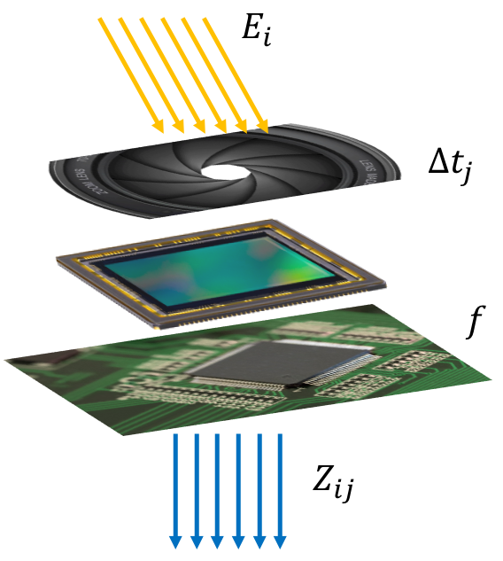

## Table of Content
1. [Problem statement and motivation](#problem-statement-and-motivation)
2. [High-level summary of the procedure](#high-level-summary-of-the-procedure)
3. [HDR radiance image reconstruction (Debevec's algorithm)](#hdr-radiance-image-reconstruction-debevecs-algorithm)
4. [Tone mapping algorithms](#tone-mapping-algorithms)
   1. [Reinhard's algorithm](#reinhards-algorithm)
   2. [Durand's algorithm](#durands-algorithm)
5. [Results](#results)
6. [Conclusion and future work](#conclusion-and-future-work)
7. [Reference](#reference)

### Problem statement and motivation
The range of intensity of light in real world is approximately **10** orders of magnitudes (e.g., star-lit scene vs. sun-lit snow) and it can be over **4** orders of magnitudes in one scene (e.g., shadows vs. highlights). However, the range of intensity of light that can be captured by normal cameras and can be displayed by normal monitors is only about **2** orders of magnitudes. The ability of capturing and displaying both very dark and very bright at the same time is characterized by the **dynamic range** of the device. The dynamic range is defined by the following equation:

  

Where  is the maximum possbile photon energy (full potential well) and  is the minimum detectable photon energy (in the presence of noise). The larger the dynamic range is, the higher the ability of distinguishing different brightness. The following table shows the dynamic ranges of several devices.

Device          |  : | Dynamic Range
:--------------:|-------------------------------------------------:|:-------------:
Human Eye       | 1,000,000:1                                      |120
HDR Display     | 200,000:1                                        |106
Digital Camera  | 4096:1                                           |72.2
Film Camera     | 2948:1                                           |66.2
Digital Video   | 45:1                                             |33.1

Due to this huge discrepancy between the dynamic range of real world and the dynamic ranges of capturing and displaying devices, the details in both very dark and very bright regions of the scene are lost. For example, the details of the color of the windows and the structures in the left dark regions are not clear in the following image.

  

When such images are used as input of various image-related algorithms, the results may not be satisfactory due to the lack of details in the image. For example, many image-based modeling and rendering systems make the assumption that all the images are taken with the same exposure settings and film response functions, which is almost impossible for any large-scale environment. Moreover, most image processing operations, such as blurring, edge detection, color correction, and image correspondence, expect pixel values to be proportional to the scene radiance. These operations will produce incorrect results for conventional images due to saturated pixels. Furthermore, generating good-looking images gains increasingly more importance with the prevalence of smart phone. Thus, the goal of this project is to explore how to bring back the details in both dark and bright regions and then generate good-looking images.

### High-level summary of the procedure

At high level, the procedure of generating good-looking images with clear details consists of two stages. 
1. In the first stage, we want to estimate the radiance value of each scene point so that we know the real light intensity of every scene point. 
2. In the second stage, we want to map the radiance image obtained from the first stage to display luminance values so that the details in dark and bright regions can be shown clearly with the display medium. 

### HDR radiance image reconstruction (Debevec's algorithm)

The goal of this stage is to estimate the radiance value at every scene point from a set of images that are taken from the same vatange point with different known exposure duration. Here, I used Debevec's algorithm\[1\] to achieve this purpose. 

Assuming we have a set of images taken from the same vantage point with the same aperture but different exposure duration. The radiance value of each scene point is , where `i` is spatial index. The exposure duration is , where `j` is time index. The pixel value corresponding to spatial index `i` and time index `j` is . As shown in the figure below, for any imaging system, photons pass through the shutter and accumulated at image sensor, then the raw data from the sensor passes through the camera response function to get the final pixel value. The camera response function `f` is a non-linear function that is different for each camera and proprietary to each manufactory. Thus, the pixel value  can be expressed as a non-linear function `f` applied to the product of  and , which is also shown below.

  

  

After taking inverse of `f` and logarithm on both sides, then simplifying the notation, we get:

  

  

  

In order to solve  for every scene point, we need to figure out the function `g` for all possible `Z` values that best satisfies the above equation in a least-square error manner. Since every scene point satisfies above equation and `Z` is an integer from 0 to 255, we can turn the problem of solving funtion `g` to an optimization problem where the objective function is shown as follows:

  

Where `N` is the number of pixels used in the linear equation system and `P` is the number of images available. The first term in the objective function ensures the solution satisfies the aforementioned equations, and the second term ensures the estimated function `g` is smooth. Minimizing the objective function  is a straightforward linear least square problem and can be easily solved in Matlab. After solving function `g`, the radiance values of each scene point can be calculated by taking the average radiance value among the `P` images, which is shown as following:

  

One natural question to ask is that how many pixels are needed to solve the equation system. Notice that in the above system, the unknowns are the value of function `g` on all possible `Z` values and the radiance values `E` of the scene points that corresponds to the picked pixels. Thus, as long as the following equation is met, the solution can be found.

  

### Tone Mapping algorithms
#### Reinhard's algorithm
#### Durand's algorithm
### Results
### Conclusion and future work
### Reference

